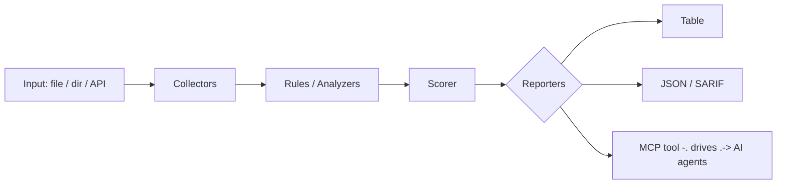

<a name="top"></a>
<div align="center">


# CHURNLENS

### Self-hosted SaaS metrics — MRR, churn, LTV from Stripe or CSV


[](#install--every-way-every-platform) [](https://github.com/cognis-digital/churnlens/actions) [](LICENSE) [](https://github.com/cognis-digital)

*Business Operations — run the company without a SaaS bill for every function.*

</div>

```bash
pip install "git+https://github.com/cognis-digital/churnlens.git"
churnlens scan .            # → prioritized findings in seconds
```

<!-- cognis:layman:start -->
## What is this?

ChurnLens is a self-hosted tool that calculates the key financial metrics for subscription businesses — things like monthly recurring revenue (MRR), customer churn rate, and lifetime value (LTV). You give it a simple CSV file listing your subscription sign-ups, upgrades, cancellations, and plan changes, and it produces a month-by-month breakdown showing exactly how your revenue is growing or shrinking. It runs entirely on your own computer or server with no account, no third-party service, and no monthly fee — making it ideal for founders, finance teams, or developers who want full control over their SaaS metrics.
<!-- cognis:layman:end -->

## Contents

- [Why churnlens?](#why) · [Features](#features) · [Quick start](#quick-start) · [Example](#example) · [Architecture](#architecture) · [AI stack](#ai-stack) · [How it compares](#how-it-compares) · [Integrations](#integrations) · [Install anywhere](#install-anywhere) · [Related](#related) · [Contributing](#contributing)

<a name="why"></a>
## Why churnlens?

own your SaaS metrics, no per-seat fee

`churnlens` is single-purpose, scriptable, and self-hostable: point it at a target, get prioritized results in the format your workflow already speaks (table · JSON · SARIF), gate CI on it, and let agents drive it over MCP.

<div align="right"><a href="#top">↑ back to top</a></div>

<a name="features"></a>
## Features

- ✅ Parse Events
- ✅ Load Events
- ✅ Compute Report
- ✅ Runs on Linux/macOS/Windows · Docker · devcontainer
- ✅ Ports in Python, JavaScript, Go, and Rust (`ports/`)

<div align="right"><a href="#top">↑ back to top</a></div>

<a name="quick-start"></a>
<!-- cognis:domains:start -->
## Domains

**Primary domain:** Revenue & Business  ·  **JTF MERIDIAN division:** FOUNDRY · MASON

**Topics:** `cognis` `business` `saas` `revenue-ops`

Part of the **Cognis Neural Suite** — 300+ source-available tools organized across 12 domains under the JTF MERIDIAN command structure. See the [suite on GitHub](https://github.com/cognis-digital) and [jtf-meridian](https://github.com/cognis-digital/jtf-meridian) for how the pieces fit together.
<!-- cognis:domains:end -->

<!-- cognis:install:start -->
## Install

`churnlens` is source-available (not published to PyPI) — every method below installs
straight from GitHub. Pick whichever you prefer; the one-line scripts auto-detect
the best tool available on your machine.

**One-liner (Linux / macOS):**
```sh
curl -fsSL https://raw.githubusercontent.com/cognis-digital/churnlens/HEAD/install.sh | sh
```

**One-liner (Windows PowerShell):**
```powershell
irm https://raw.githubusercontent.com/cognis-digital/churnlens/HEAD/install.ps1 | iex
```

**Or install manually — any one of:**
```sh
pipx install "git+https://github.com/cognis-digital/churnlens.git"     # isolated (recommended)
uv tool install "git+https://github.com/cognis-digital/churnlens.git"  # uv
pip install "git+https://github.com/cognis-digital/churnlens.git"      # pip
```

**From source:**
```sh
git clone https://github.com/cognis-digital/churnlens.git
cd churnlens && pip install .
```

Then run:
```sh
churnlens --help
```
<!-- cognis:install:end -->

## Quick start

```bash
pip install "git+https://github.com/cognis-digital/churnlens.git"
churnlens --version
churnlens scan .                       # scan current project
churnlens scan . --format json         # machine-readable
churnlens scan . --fail-on high        # CI gate (non-zero exit)
```

<div align="right"><a href="#top">↑ back to top</a></div>

<a name="example"></a>
## Example

```text
$ churnlens scan .
  [HIGH    ] CHU-001  example finding             (./src/app.py)
  [MEDIUM  ] CHU-002  another signal              (./config.yaml)

  2 findings · risk score 5 · 38ms
```

<div align="right"><a href="#top">↑ back to top</a></div>

<a name="architecture"></a>
## Architecture



<div align="right"><a href="#top">↑ back to top</a></div>

<a name="ai-stack"></a>
## Use it from any AI stack

`churnlens` is interoperable with every popular way of using AI:

- **MCP server** — `churnlens mcp` (Claude Desktop, Cursor, Cognis.Studio, [uncensored-fleet](https://github.com/cognis-digital/uncensored-fleet))
- **OpenAI-compatible / JSON** — pipe `churnlens scan . --format json` into any agent or LLM
- **LangChain · CrewAI · AutoGen · LlamaIndex** — wrap the CLI/JSON as a tool in one line
- **CI / scripts** — exit codes + SARIF for non-AI pipelines

<div align="right"><a href="#top">↑ back to top</a></div>

<a name="how-it-compares"></a>
## How it compares

| | **Cognis churnlens** | Baremetrics |
|---|:---:|:---:|
| Self-hostable, no account | ✅ | varies |
| Single command, zero config | ✅ | ⚠️ |
| JSON + SARIF for CI | ✅ | varies |
| MCP-native (AI agents) | ✅ | ❌ |
| Polyglot ports (JS/Go/Rust) | ✅ | ❌ |
| Open license | ✅ COCL | varies |

*Built in the spirit of **Baremetrics**, re-framed the Cognis way. Missing a credit? Open a PR.*

<div align="right"><a href="#top">↑ back to top</a></div>

<a name="integrations"></a>
## Integrations

Pipes into your stack: **SARIF** for code-scanning, **JSON** for anything, an **MCP server** (`churnlens mcp`) for AI agents, and a webhook forwarder for SIEM/Slack/Jira. See [`docs/INTEGRATIONS.md`](docs/INTEGRATIONS.md).

<div align="right"><a href="#top">↑ back to top</a></div>

<a name="install-anywhere"></a>
## Install — every way, every platform

```bash
pip install "git+https://github.com/cognis-digital/churnlens.git"    # pip (works today)
pipx install "git+https://github.com/cognis-digital/churnlens.git"   # isolated CLI
uv tool install "git+https://github.com/cognis-digital/churnlens.git" # uv
pip install cognis-churnlens                                          # PyPI (when published)
docker run --rm ghcr.io/cognis-digital/churnlens:latest --help        # Docker
brew install cognis-digital/tap/churnlens                             # Homebrew tap
curl -fsSL https://raw.githubusercontent.com/cognis-digital/churnlens/main/install.sh | sh
```

| Linux | macOS | Windows | Docker | Cloud |
|---|---|---|---|---|
| `scripts/setup-linux.sh` | `scripts/setup-macos.sh` | `scripts/setup-windows.ps1` | `docker run ghcr.io/cognis-digital/churnlens` | [DEPLOY.md](docs/DEPLOY.md) (AWS/Azure/GCP/k8s) |

<div align="right"><a href="#top">↑ back to top</a></div>

<a name="related"></a>
<a name="verification"></a>
## Verification

[](AUDIT.md)

Every push is verified end-to-end. Latest audit (2026-06-13):

```text
tests        : 12 passed, 0 failed, 0 errored
compile      : all modules parse
cli          : churnlens --version OK
package      : churnlens
```

<details><summary>CLI surface (<code>--help</code>)</summary>

```text
usage: churnlens [-h] [--version] {report,mrr} ...

Self-hosted SaaS metrics: MRR, churn, LTV from a CSV ledger.

positional arguments:
  {report,mrr}
    report      full per-month metrics report
    mrr         latest-month MRR movement summary

options:
  -h, --help    show this help message and exit
  --version     show program's version number and exit
```
</details>

Full machine-readable results: [`AUDIT.md`](AUDIT.md) · regenerate with `python -m churnlens --help` + `pytest -q`.

<div align="right"><a href="#top">↑ back to top</a></div>


## Related Cognis tools

- [`invoctl`](https://github.com/cognis-digital/invoctl) — CLI invoicing + payment-link generator with PDF and a local ledger
- [`leadforge`](https://github.com/cognis-digital/leadforge) — Lightweight MCP-native CRM pipeline with email sequences
- [`quotecraft`](https://github.com/cognis-digital/quotecraft) — Proposal / quote / SOW generator — YAML to branded PDF
- [`boardroom`](https://github.com/cognis-digital/boardroom) — Investor-update and KPI one-pager generator from your metrics
- [`seataudit`](https://github.com/cognis-digital/seataudit) — SaaS license, seat-usage and shadow-IT auditor
- [`paywatch`](https://github.com/cognis-digital/paywatch) — Recurring-charge and subscription detector from bank/Plaid CSV

**Explore the suite →** [🗂️ all 170+ tools](https://github.com/cognis-digital/cognis-neural-suite) · [⭐ awesome-cognis](https://github.com/cognis-digital/awesome-cognis) · [🔗 cognis-sources](https://github.com/cognis-digital/cognis-sources) · [🤖 uncensored-fleet](https://github.com/cognis-digital/uncensored-fleet) · [🧠 engram](https://github.com/cognis-digital/engram)

<div align="right"><a href="#top">↑ back to top</a></div>

<a name="contributing"></a>
## Contributing

PRs, new rules, and demo scenarios are welcome under the collaboration-pull model — see [CONTRIBUTING.md](CONTRIBUTING.md) and [SECURITY.md](SECURITY.md).

> ### ⭐ If `churnlens` saved you time, **star it** — it genuinely helps others find it.

## License

Source-available under the **Cognis Open Collaboration License (COCL) v1.0** — free for personal, internal-evaluation, research, and educational use; **commercial / production use requires a license** (licensing@cognis.digital). See [LICENSE](LICENSE).

---

<div align="center"><sub><b><a href="https://cognis.digital">Cognis Digital</a></b> · one of 170+ tools in the <a href="https://github.com/cognis-digital/cognis-neural-suite">Cognis Neural Suite</a> · <i>Making Tomorrow Better Today</i></sub></div>
